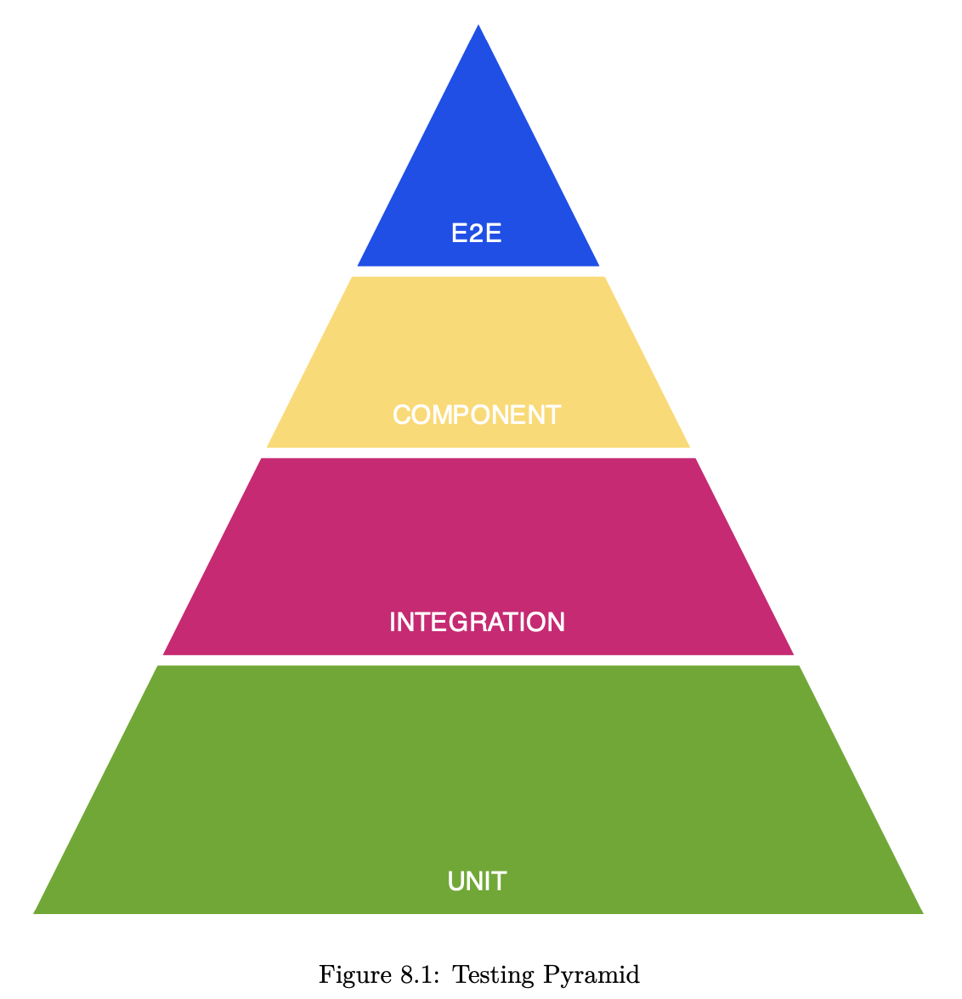
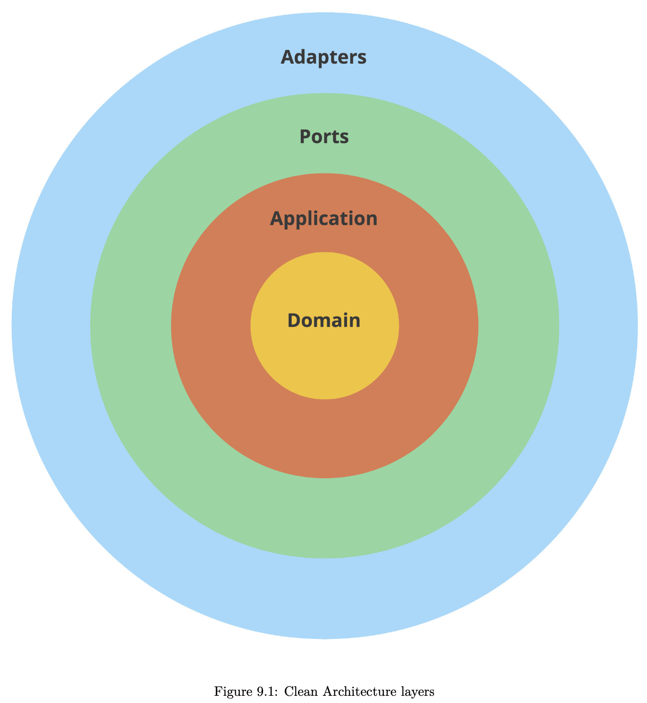
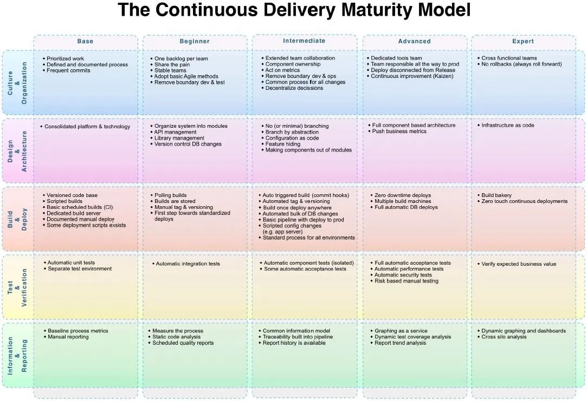
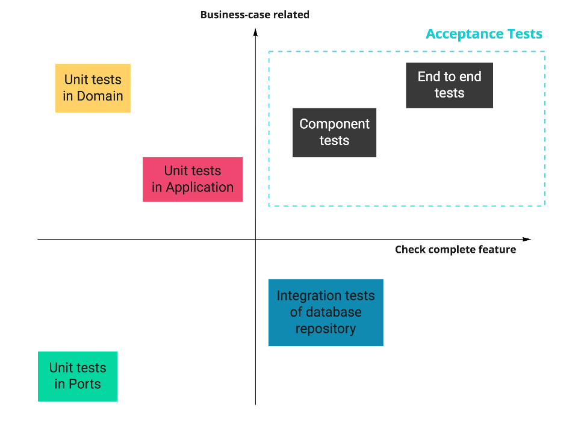

# Go with Domain

By Three Dots Lab

## Acronyms and Introduction

DDD: Domain Driven Design

SOLID:

- Single responsibility principle
- Open/closed principle
- Liskov substitution principle
- Interface segregation
- Dependency inversion principle

“The alternative to good design is always bad design. There is no such thing as no design.”
- Adam Judge

It’s worth discussing architecture decisions before you stumble on issues. “No architecture” will just leave you with bad architecture.

**Domain-driven design (DDD)** is the concept that the structure and language of your code (class names,
class methods, class variables) should match the **business domain**.

Coding is a war, to win you need a strategy!

Strategic DDD patterns is a set of patterns that helps us bridge the gap between the solution created  and the business problem.

Do Event Storming, a technique to discuss with stakeholders all angles of the product and/or service.

## Reflect Your Business Logic

The First Rule - reflect your business logic literally.

You should instead think about them like types with behavior.

## Keep a Valid State in Memory

The Second Rule: always keep a valid state in the memory.

Rugged Software: describes software development organizations that have a culture of rapidly evolving their ability to create available, survivable, defensible, secure, and resilient software. (Ref: https://ruggedsoftware.org/)

Our goal is to do validation in only one place (good DRY) and ensure that nobody can change the internal state of an object/struct. The only public API of the object should be methods describing behaviors.

We need to also put our types to separate package and make all attributes private.

## Domain Needs to be Database Agnostic

The Third Rule - domain needs to be database agnostic. Keeping the domain strictly without any database influence works best.

The most important reasons are:

- Domain types are not shaped by used database solution – they should only be shaped by business rules
- Store data in database in a more optimal way

## The Repository Pattern

Keeping logic of your application along with your database logic makes your application much more complex, hard to test, and maintain.

The **repository pattern** allows you to separate your application logic from database logic. It allows you to make your code simpler and easier to add new functionalities.

As a bonus, you can defer important decision of choosing database solution and schema.

Another good side effect of this approach is immunity for database vendor lock-in.

### Repository Interface

Let’s abstract our database implementation by defining interaction with it by the interface. You need to be able to use this interface for any database implementation – that means that it should be free of any implementation details of any database.

When we use the Domain-First approach, the first and simplest repository implementation may be in-memory implementation.

Deferring the decision about the database for later can save some time at the beginning of the project. With more information and context, we can also make a better decision for database vendor.

It’s better to entirely separate domain types from the database. Some advantages are:

- It’s easier to test
- We don’t duplicate validation
- It does not introduce a lot of boilerplate

### Updating the Data

[**Optimistic concurrency control**](https://en.wikipedia.org/wiki/Optimistic_concurrency_control) assumes that many transactions can frequently complete without interfering with each other.

The biggest challenge now is "how to manage transactions in a clean way that does not affect the rest of the application too much, is not dependent on the implementation, and is explicit and fast?"

There are many options, but favorite is **an approach based on closure passed to the function**. Advantages of using this approach:

- Get and provide all parameters for passed in function
- Execute the closure
- Save return values (or return more)
- Execute a rollback in case of an error returned from the closure

## High-Quality Database Integration Tests

To develop your application easily and with confidence, you need to have a set of tests on multiple levels.

Basic Go testing techniques:

- Test tables
- Assert functions
- Parallel execution
- Black-box testing

When big part of our application is connected to some infrastructure (for example: database) it’s just hard to cover a lot of functionality with unit tests.

### 4 Principles of High-Quality Tests

1. Speed: good tests need to be fast
2. Testing enough scenarios on all levels
3. Tests need to be robust and deterministic
4. Be able to execute most of the tests locally

### Implementation

The way how we can interact with our database is defined by the `Repository` interface. It assumes that our repository implementation is stupid. All complex logic is handled by the domain part of our application. 

Our `Repository` should just save the data without any validations, etc. 

One of the significant advantages of that approach is the simplification of the repository and tests implementation.

It's always a good idea to build all non-unit tests to be able to work in parallel, so your tests will be always fast and you will not be afraid to add more tests because of
↪ slowdown, `t.Parallel()`.

There is a popular github.com/stretchr/testify library. It significantly reduces boilerplate in tests by providing multiple helpers for asserts.

If asserts fail, test executions are not interrupted. However, asserts from the `require` pkg are used, then it does fail and interrupts tests.

When we assert multiple values, assert is a better choice, because you will receive more context.

If we have more specific data to assert, it’s always a good idea to add some helpers. It removes a lot of duplication, and improves tests readability a lot.

## Clean Architecture

“Low coupling, high cohesion” concept, the main benefit of clean architecture.

A big part of it is abstracting away implementation details, a standard in technology, especially software. Another name for it is separation of concerns.

Our approach to Clean Architecture is two ideas combined:

1. Separating Ports and Adapters
2. Limiting how code structures refer to each other

### Separating Ports and Adapters

Ports and adapters can also be called interfaces and infrastructure, or groups that are divided in "layers":

- An **adapter** is how your application talks to the external world, adapt your internal structures to what the external API expects
- A **port** is an input to your application
- The **application** logic is a thin layer that “glues together” other layers. It’s also known as “use cases”, think of it as the "orchestrator"
- **Domain layers** holds business logic

Mixing the business rules with the database model slows down development, as the code becomes hard to understand and reason about. It’s also difficult to test such logic.

### The Dependency Inversion Principle

A clear separation between ports, adapters, and application logic is useful by itself. Clean Architecture improves it further with Dependency Inversion.

The rule states that outer layers (implementation details) can refer to inner layers (abstractions), but not the other way around. The inner layers should instead depend on interfaces.

- The **Domain** knows nothing about other layers whatsoever
  - The **Domain** contains pure business logic
- The **Application** can import domain but knows nothing about outer layers
  - The **Application** has no idea whether it’s being called by an HTTP request, a Pub/Sub handler, or a CLI command
- **Ports** can import inner layers
  - **Ports** are the entry points to the application, so they often execute application services or commands
  - **Ports** can’t directly access _Adapters_
- **Adapters** can import inner layers
  - Usually, **Adapters** will operate on types found in _Application_ and _Domain_, for example, retrieving them from the database

## CQRS (Command Query Responsibility Segregation)

In practice, CQRS is a very simple pattern that does not require a lot of investment. It can be easily extended with more complex techniques like event-driven architecture, event-sourcing, or polyglot persistence.

CQRS has one simple assumption: instead of having one big model for reads and writes, it has two separate models, one for writes and one for reads. It also introduces concepts of **command** and **query**, and leads to splitting application services into two separate types: **command** and **query** handlers.

In simplest words: a **Query** should not modify anything, just return the data. A **command** is the opposite: it should make changes in the system, but not return any data.

### Naming

There is a rule that says you should stick to the language that is as close as it can be to how non-technical people (often referred to as “business”) talk. It also applies to **Commands** and **Queries** names.

Go to your business people and listen how they call operations. Think twice if any of your command names really need to start with
“Create/Delete/Update”.

### Async Commands

Some commands are slow by nature. They may be doing some external calls or some heavy computation. In that case, we can introduce **Asynchronous Command Bus**, which executes the command in the background.

### Separate DBs for Reads and Writes

If we need to provide more complex queries or need really fast reads, we could use the **polyglot persistence technique**. The idea is to duplicate queried data in a more optimal format in another database. For example, we could use Elastic to index some data that can be searched and filtered more easily.

Data synchronization, in this case, can be done via _events_. One of the most important implications of this approach is **eventual consistency**. You should ask yourself if it’s an acceptable tradeoff in your system. If you are not sure, you can just start without polyglot persistence and migrate later.

### Event Sourcing

If you work in a domain with strict audit requirements, you should definitely check out the **event sourcing technique**. It provides out-of-the-box audit and helps with reverting some bug implications.

CQRS is often described together with event sourcing. The reason is that by design in event-sourced systems, we don’t store the model in a format ready for reads (queries), but just a list of events used by writes (commands). In other words, it’s harder to provide any API responses.

## Combining DDD, CQRS, and Clean Architecture

You need to create your code in a way that will not block your future work. Even if at the beginning it may look like over-engineering and a lot of extra boilerplate, you need to keep in mind the long term. This is exactly what these patterns give you when they are combined – the ability to keep constant development speed without destroying and touching existing code too much.

To start building a domain layer, we need to identify the use cases of the application. Look at RPC and HTTP endpoints to find supported use cases.

If you don’t believe that this code may become complex, I recommend checking the Git history of the worst place in the project you work on. We should be sensitive to emerging complexity and try to simplify it as soon as we can.

### Orchestrate with Command

The application layer can be responsible only for the orchestration of the flow. There is no domain logic there. We hide the entire business complexity in the domain layer.

If you start to see some if’s related to logic in your application layer, you should think about how to move it to the domain layer. It will be easier to test and re-use in other places.

It may depend on the project, but often domain logic is pretty stable after the initial development and can live unchanged for a long time. It can survive moving between services, framework changes, library changes, and API changes.

### Refactoring

When you are doing refactoring, it’s also critical to agree on reasonable timeboxes. And keep them. You can quickly lose your stakeholders’ trust when you spend an entire month on refactoring, and the improvement is not visible. It is also critical to integrate and deploy your refactoring as fast as you can.

## Tests Architecture

End-to-end tests might give you some confidence, but you don’t want to maintain such a test suite. It’s hard to debug, takes a long time to test even the simplest change, and releasing the application takes hours. Introducing new tests is also not trivial in this scenario, so developers avoid it if they can.

### Unit Tests

The domain layer is where the most complex logic of your service lives. However, the tests here should be some of the simplest to write and running super fast. There are no external dependencies in the domain, so you don’t need any special infrastructure or mocks.

As a rule of thumb, you should aim for high test coverage in the domain layer. Table-driven tests are especially great for this.

Watch out for complex logic living in the application layer. If you start testing business scenarios here, it’s worth considering introducing the domain layer.

On the other hand, it’s the perfect place for orchestration — calling adapters and services in a particular order and passing the return values around. If you separate it like that, application tests should not break every time you change the domain code.

There are many external dependencies in the application’s commands and queries, as opposed to the domain code.

In most cases, a struct with a single method will make a perfect mock here. If you prefer to use mocking libraries or code-generated mocks, you can use them as well.

### Integration Tests

There’s no reason for integration tests to be slow and flaky. And practices like automatic retries and increasing sleep times should be absolutely out of the question.

In our context, an integration test is a test that checks if an adapter works correctly with an external infrastructure, i.e. database repositories.

These tests are not about checking whether the database works correctly, but whether you use it correctly (the integration part). It’s also an excellent way to verify if you know how to use the database internals, like handling transactions.

Because we need real infrastructure, integration tests are more challenging than unit tests to write and maintain. Usually, we can use docker-compose to spin up all dependencies.

When dealing with network calls and databases, the test speed becomes super important. It’s crucial to run tests in parallel, which can be enabled in Go by calling `t.Parallel()`.

### Component Tests

Component tests are used to make sure each service works correctly internally. It checks all layers are working together without errors.

These tests call real port handlers and use infrastructure provided by Docker, however, it uses mocks for all adapters (external services).

In component tests, our goal is to check the completeness of a single service in isolation, with all infrastructure it needs.

If you follow the **Dependency Inversion Principle** (part of SOLID), injecting mocks at the service level should be trivial.

It's crucial to ensure the service has properly started, and DO NOT replace it with `sleeps`. This will add too much delay or make it fail randomly.

Testing for happy paths using component tests should be enough. Edge cases should be covered by unit and integration tests.

### End-to-end Tests

End-to-end tests verify your whole system working together. They're slow, error-prone, and hard to maintain.

They're still needed, but a good organization, planning and management is required.

It could be run as:

- Spin up all services inside a docker-compose, K8s cluster or some type of testing environment
- Verify a few critical paths calling HTTP endpoints or anything exposed to the external world

The hard questions to answer about end-to-end tests are:

- Where should they be kept?
- Which team should own it?
- Where to run it?
- How often to run it?
- Should they be part of the CI/CD pipeline or a separate thing ran from a cron job?

End-to-end tests should be short and used to test if services are working correctly together, not the logic inside of them.

### Acceptance Tests

Acceptance tests focuses on a complete business feature instead of implementation details. Sometimes acceptance tests can be used to refer to component and/or end-to-end tests.

Just keep in mind that no test suite will give you 100% confidence. It's IMPORTANT to have a process in place that allows:

- Quick rollbacks
- Reverts
- Undoing migrations

## Repository Secure By Design

You will be surprised how long the code you have written will live. We should not trust ppl to use the code we've created in the way it's intended - they will not.

In some cases, the solution that will protect us from issues like that is **good design**. Good design should not allow using our code in an invalid way.

The repository should be the only one accessing data. Because of that, adding authorization on the repository level makes sense. 

TL;DR: **repository** is a pattern that helps us abstract db implementation from our app logic.

To achieve this robust design, we need to implement 3 things:

1. Consolidate logic about who can access what (domain layer)
2. Find all functions/methods that get a resource from db
3. Find all functions/methods that insert or update a record into db

